# Pozo

> Reclamos urbanos hiperlocales: fotografiás el problema de tu cuadra, tus vecinos lo
> confirman y el municipio lo gestiona como un expediente.

TPO de Apps Móviles, UCA. App móvil hecha con Expo y React Native.

## ¿Qué es Pozo?

Un pozo en la esquina, una vereda rota, una luminaria apagada o un contenedor desbordado:
todos los vecinos lo ven, pocos lo reportan y casi nadie sabe si el reclamo llegó a algún
lado. Los canales de atención suelen ser lentos, opacos y desconectados del lugar donde
está el problema. El municipio, por su parte, recibe reclamos sueltos, duplicados y sin
evidencia, y le cuesta decidir qué atender primero.

Pozo resuelve las dos puntas. El **vecino** reporta con una foto sacada con la cámara de la
app y la ubicación real del teléfono, así cada reclamo llega con evidencia y coordenadas. Los
demás vecinos lo **confirman** con un toque: cuando junta suficientes confirmaciones, el
reclamo pasa a ser un pedido validado por la comunidad. A cada reclamo se le arma un
**expediente** con número de caso, historial de estados y fechas, que el vecino puede seguir
hasta que se resuelve.

Del otro lado, el **municipio** tiene su propio panel dentro de la misma app: una bandeja
priorizada (más confirmaciones, más antigüedad y categorías peligrosas primero), un mapa con
todos los reclamos, un tablero con estadísticas y las herramientas para gestionarlos
(asignar un área, fijar una fecha estimada, pasar a reparación, resolver con foto del
"después" o rechazar con motivo). Se avisa cuando un reclamo está vencido respecto del plazo
de su área.

## Capturas

### Ingreso

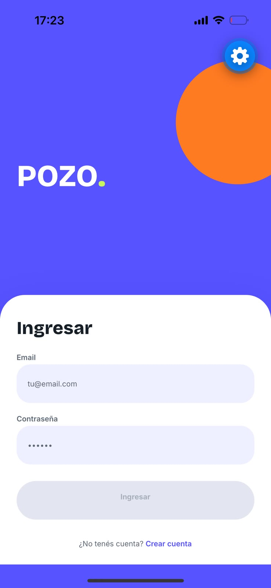

### Vecino

| Mapa | Nuevo reclamo | Detalle |
|---|---|---|
| 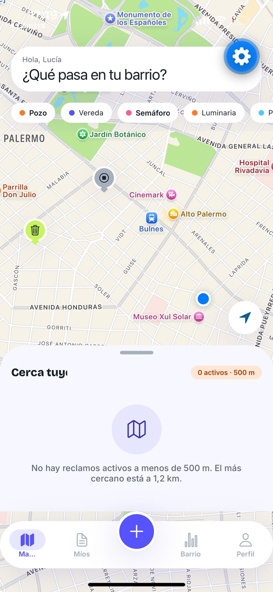 | 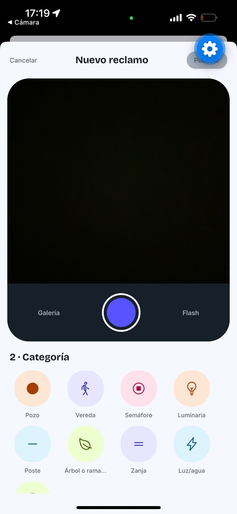 | 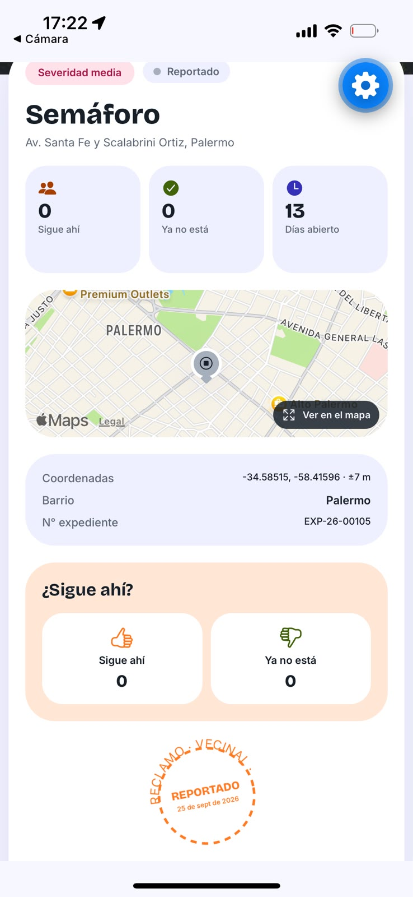 |

| Mis reclamos | Estadísticas del barrio | Perfil |
|---|---|---|
| 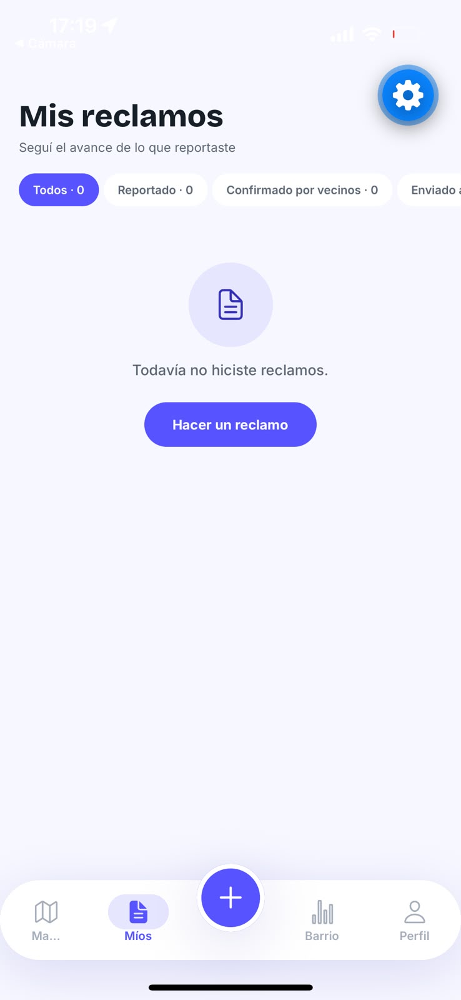 | 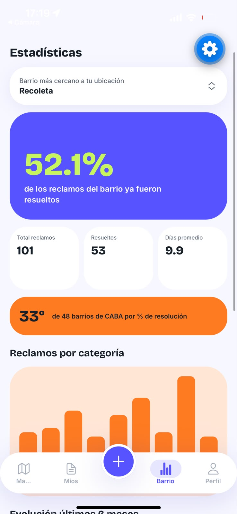 | 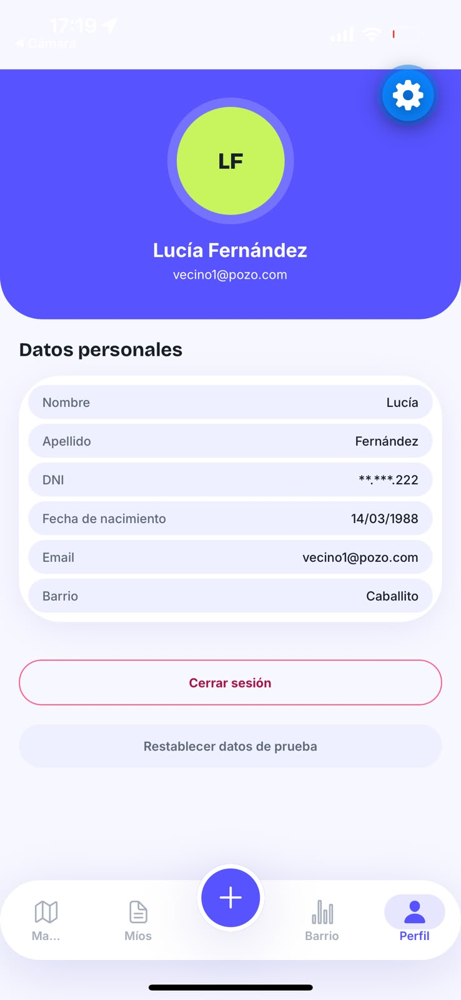 |

### Municipio

| Bandeja | Mapa | Tablero | Gestión del reclamo | Perfil |
|---|---|---|---|---|
| 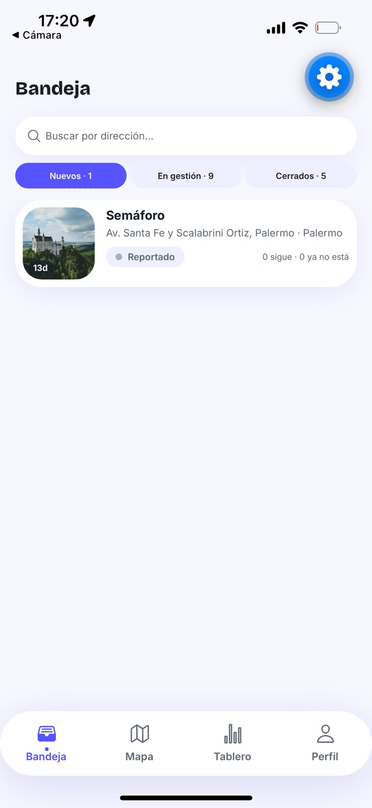 | 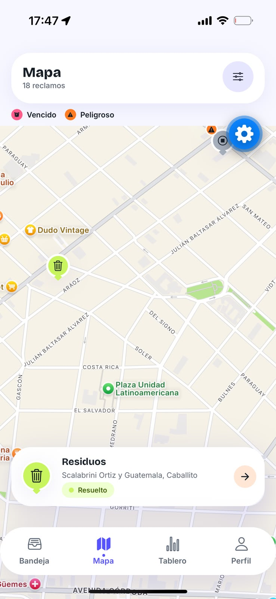 | 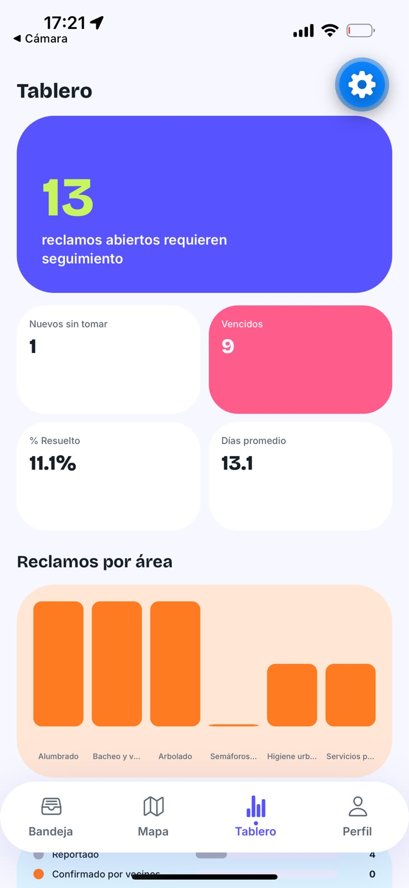 | 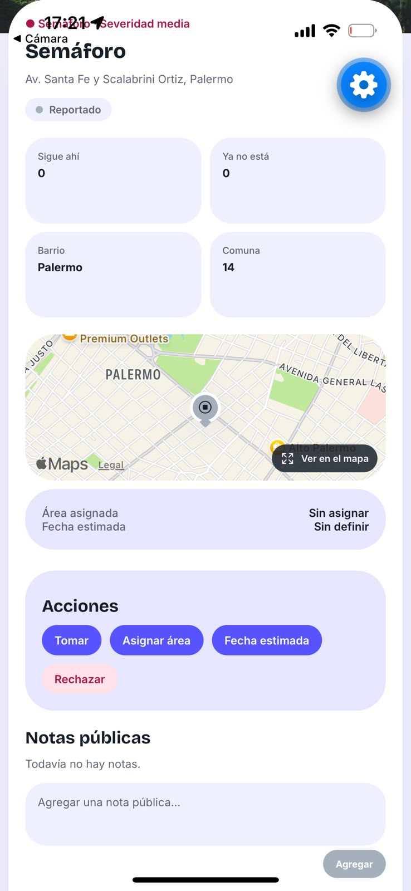 | 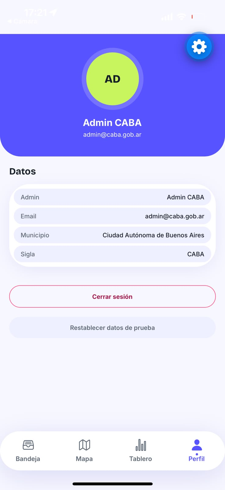 |

## Funcionalidades

### Vecino

- **Registro con el DNI:** se escanea el código PDF417 del dorso con la cámara. Los datos
  se completan solos.
- **Nuevo reclamo:** foto con la cámara (o de la galería), ubicación por GPS, categoría
  (pozo, vereda, semáforo, luminaria, poste, árbol caído, zanja, corte de luz o agua,
  residuos), severidad y notas.
- **Aviso de reclamo cercano:** antes de publicar, si ya hay un reclamo abierto de la misma
  categoría a menos de 50 metros, la app lo muestra y deja confirmarlo en lugar de duplicarlo.
  Si es un reclamo del propio usuario, se lo avisa.
- **Mapa:** todos los reclamos, con filtros por categoría y estado. Los reclamos muy
  cercanos se agrupan en un círculo con la cantidad; al tocarlo, el mapa hace zoom hasta
  separarlos. Si están en el mismo punto exacto, se muestra una lista para elegir cuál abrir.
- **Confirmar reclamos de otros vecinos** (una vez por persona, nunca el propio).
- **Mis reclamos y detalle:** línea de tiempo del expediente, foto, mapa, antes y después
  cuando se resuelve.
- **Estadísticas por barrio.**

### Municipio

- **Bandeja** con tres segmentos (Nuevos, En gestión, Cerrados), búsqueda por dirección y
  filtros por barrio, comuna, categoría y área. Orden por prioridad y marca de **vencido**.
- **Mapa** con los mismos filtros, marca visual para los reclamos vencidos y los peligrosos, y
  una tarjeta que abre el detalle con gestión.
- **Gestión del reclamo:** tomar, asignar área, fijar fecha estimada, pasar a reparación,
  resolver (la foto del "después" es obligatoria), rechazar (el motivo es obligatorio) y
  agregar notas públicas.
- **Tablero** con estadísticas del municipio.

### Circuito de estados de un reclamo

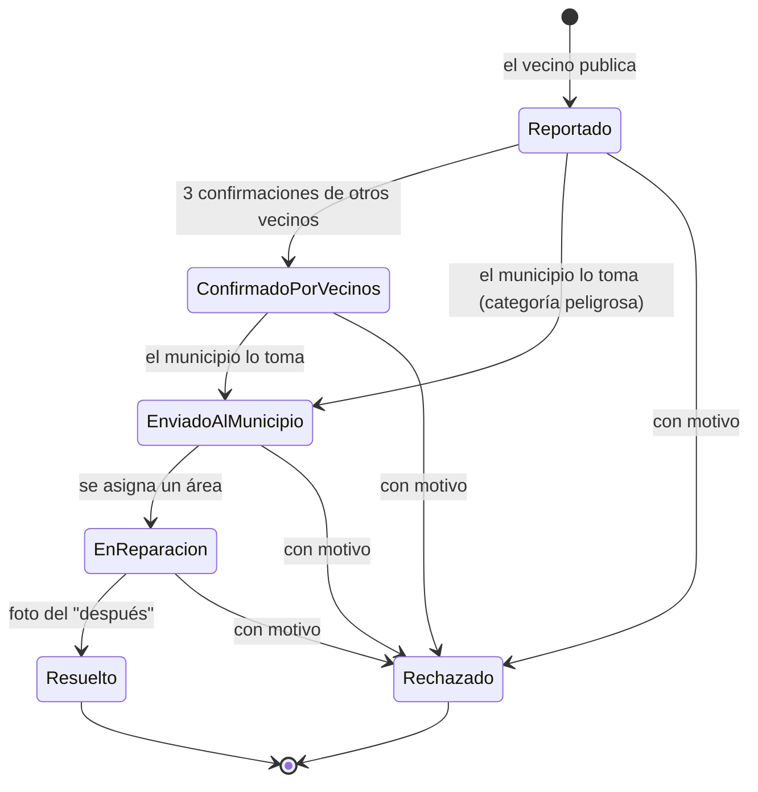

Los dos primeros estados los produce el vecino; del tercero en adelante los cambia solo el
municipio. Las categorías peligrosas (poste caído, árbol caído, corte de luz o agua y
semáforo) pueden pasar directo al municipio sin esperar confirmaciones. `Resuelto` y
`Rechazado` son estados finales.

## Stack y decisiones técnicas

| Pieza | Elección |
|---|---|
| App | **Expo** (SDK 57) + React Native + TypeScript |
| Navegación | **expo-router**: rutas por archivos, grupos de tabs separados para vecino y municipio |
| Cámara | **expo-camera**: foto del reclamo y lectura del PDF417 del DNI (componente nativo) |
| Ubicación | **expo-location**: GPS real y dirección aproximada (componente nativo) |
| Mapa | **react-native-maps** (Apple Maps en iOS, Google Maps en Android) |
| Agrupado de marcadores | **supercluster** (JavaScript puro, funciona en Expo Go) |
| Almacenamiento local | **AsyncStorage**: usuarios, reclamos y sesión · **expo-file-system**: copia permanente de las fotos que saca el vecino |
| Gráficos y sellos | react-native-svg |

Decisiones:

- **Servicios que simulan la API.** Las pantallas nunca tocan el almacenamiento: llaman a
  funciones de `services/` (`login`, `publicarReclamo`, `confirmarReclamo`, `tomar`,
  `resolver`…). Hoy esas funciones leen y escriben AsyncStorage; cuando exista el backend,
  son lo único que hay que reemplazar.
- **Reglas de negocio puras.** La máquina de estados (`lib/maquinaEstados.ts`), la prioridad
  y el vencimiento (`lib/prioridad.ts`) y la distancia entre reclamos (`lib/distancia.ts`)
  son funciones sin efectos, fáciles de probar.
- **Datos de prueba en JSON.** Usuarios, reclamos, barrios y áreas se cargan una sola vez
  desde `mobile/data/` y nunca pisan lo que ya está guardado.
- **Sesión hidratada.** `AuthProvider` lee la sesión de AsyncStorage al montar, la parsea y
  recién entonces marca `isHydrated`; nada se escribe antes de eso.
- **Tokens de diseño.** Colores, tipografías y espaciado salen de `mobile/theme/`; no hay
  valores sueltos en las pantallas.
- **Un solo mapa.** El mapa del vecino y el del municipio comparten el mismo componente
  (`ReclamosMap`), así que las mejoras de uno llegan al otro.

## Estructura de carpetas

```
mobile/
  app/             Pantallas y rutas (expo-router)
    (tabs)/        Tabs del vecino: Mapa, Mis reclamos, Nuevo, Barrio, Perfil
    (admin)/       Tabs del municipio: Bandeja, Mapa, Tablero, Perfil
    reclamos/      Nuevo reclamo, reclamo publicado y detalle del vecino
    admin-reclamo/ Detalle con gestión del municipio
  components/      Piezas reutilizables (mapa, marcadores, sellos, modales)
  constants/       Etiquetas en español, íconos y colores de estados y categorías
  contexts/        AuthContext: sesión y estado de hidratación
  data/            Datos de prueba en JSON
  lib/             Reglas puras (estados, prioridad, distancia, filtros)
  services/        Acceso a datos: simulan la API sobre AsyncStorage
  theme/           Colores, tipografías y espaciado
  types/           Tipos compartidos
  assets/reclamos/ Fotos de los reclamos de prueba
docs/              Diseño funcional, modelo de datos, ADRs y sprints
backend/           API (en construcción, Sprint 2)
```

## Cómo correrlo

### Requisitos

- Node.js (versión LTS) y npm.
- La app **Expo Go** en el celular (Android o iOS), en una versión compatible con el SDK 57.
- Celular y computadora en la misma red Wi-Fi.

### Instalación y arranque

```bash
cd mobile
npm install
npx expo start
```

Escaneá el QR con la cámara (iOS) o desde Expo Go (Android). Con `w` se abre la versión web,
aunque la cámara y el mapa están pensados para el celular.

### Si el celular no se conecta: `--tunnel`

```bash
npx expo start --tunnel
```

Crea un túnel que funciona aunque el celular y la computadora estén en redes distintas o la
red bloquee conexiones entre dispositivos (redes de universidad, por ejemplo). La primera vez,
Expo pide instalar `@expo/ngrok`: aceptá. Es más lento que la red local.

### Problemas comunes

- **No conecta el celu:** revisá que estén en la misma Wi-Fi, que el firewall de la
  computadora permita Node y que la red no aísle los dispositivos. Si nada funciona, usá
  `--tunnel`.
- **"Project is incompatible with this version of Expo Go":** la versión de Expo Go no
  coincide con el SDK 57. Actualizá Expo Go desde la tienda de aplicaciones.
- **El mapa no muestra datos o se ve viejo:** los reclamos se guardan en el teléfono. En
  modo desarrollo, Perfil → **Restablecer datos de prueba** vuelve todo al estado inicial.
- **La caché de Metro da errores raros:** `npx expo start -c`.
- **Revisión de tipos:** `npm run typecheck` (no hay linter ni tests configurados todavía).

### Usuarios de prueba

Se cargan solos la primera vez que se abre la app.

| Email | Contraseña | Rol |
|---|---|---|
| `vecino1@pozo.com` | `123456` | Vecino (Lucía, Caballito) |
| `vecino2@pozo.com` | `123456` | Vecino (Martín, Palermo) |
| `vecino3@pozo.com` | `123456` | Vecino (Noelia, Flores) |
| `admin@caba.gob.ar` | `123456` | Admin (municipio CABA) |

También se puede crear una cuenta de vecino nueva escaneando un PDF417 con el formato
`trámite@apellido@nombres@sexo@dni@ejemplar@nacimiento@emisión`. Los admin no se registran
desde la app.

## Branding

| Color | HEX | Uso |
|---|---|---|
| Cobalto | `#5653FF` | Color principal: botones, pestaña activa, fondos de marca |
| Cobalto profundo | `#3431B8` | Texto e íconos sobre cobalto suave |
| Mandarina | `#FF7A21` | Acento: pozo, gráficos y destacados |
| Lima | `#C8F45D` | Acento: cifras destacadas y avatar |
| Rosa | `#FF5C8A` | Alertas y semáforo |
| Cielo | `#53C8FF` | Luz/agua y estados informativos |
| Tinta | `#17202A` | Texto principal |
| Fondo | `#F7F8FF` | Fondo de pantallas |

Cada color de acento tiene una variante `Deep` para texto y una `Soft` para fondos (ver `mobile/theme/colors.ts`).

Tipografías: **Bricolage Grotesque** (700 y 800) para títulos y **Inter** (400 a 800) para el resto del texto.

## Equipo

- Martín Allende ([@martinallende02](https://github.com/martinallende02))
- Nicolas Coloritto ([@nicocoloritto](https://github.com/nicocoloritto))
- Isidro Pasman ([@isidropasman](https://github.com/isidropasman))


## Documentación y créditos

- **Entrega del Sprint 1:**
  - [`Pozo-Sprint1-Presentacion.pdf`](docs/Entrega-Sprint1/Pozo-Sprint1-Presentacion.pdf):
    temática, público objetivo, diferencial, modelo de negocio, branding y componentes nativos.
  - [`Pozo-Mockup.pdf`](docs/Entrega-Sprint1/Pozo-Mockup.pdf): mockup con las pantallas del
    vecino y del municipio, y el circuito de estados.
- **Diseño funcional:** [`docs/diseno-funcional.md`](docs/diseno-funcional.md): roles, estados, reglas
  de negocio y comportamiento de cada pantalla.
- **Fotos de los reclamos de prueba:** autor y fuente de cada una en
  [`mobile/assets/reclamos/CREDITOS.md`](mobile/assets/reclamos/CREDITOS.md) (Unsplash y/o Pexels).

## Próximos pasos

- **Backend real:** API con Express, Prisma y SQLite (Sprint 2), reemplazando los servicios
  que hoy simulan la API sobre AsyncStorage.
- **Base de datos del municipio:** que el municipio cargue y mantenga sus áreas, plazos,
  cuadrillas y barrios, y que se pueda sumar más de un municipio.
- **Notificaciones:** avisar al vecino cuando cambia el estado de su reclamo y al municipio
  cuando entra uno peligroso o se vence un plazo.
- **Almacenamiento de fotos** en un servidor, en lugar de la ruta local del teléfono.
- **Modo sin conexión** con sincronización posterior.
